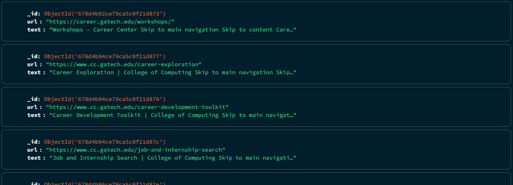
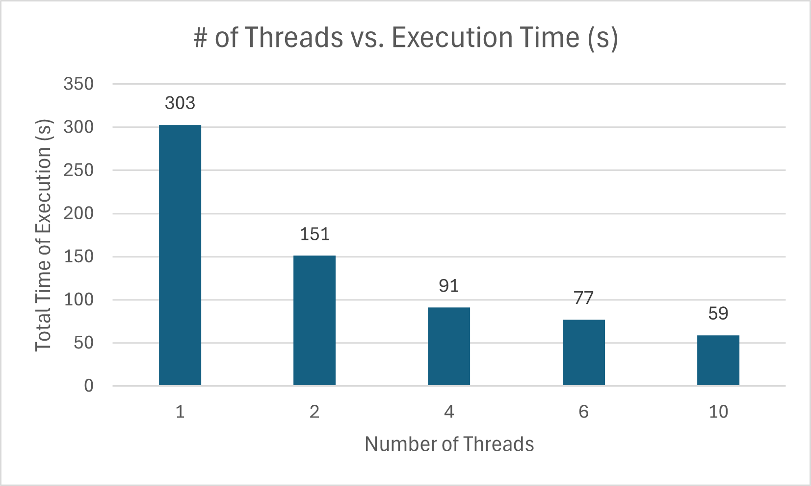
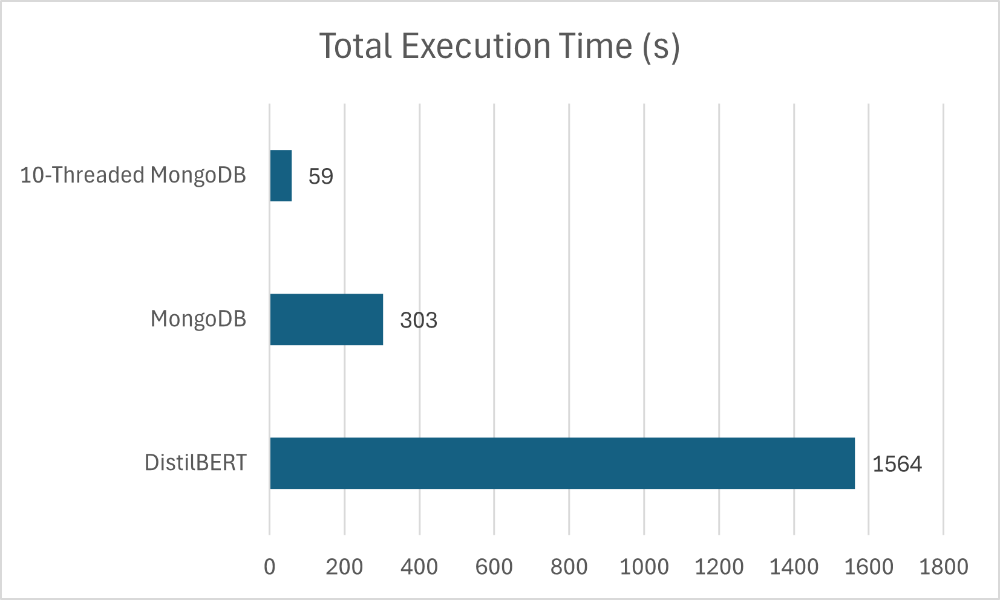
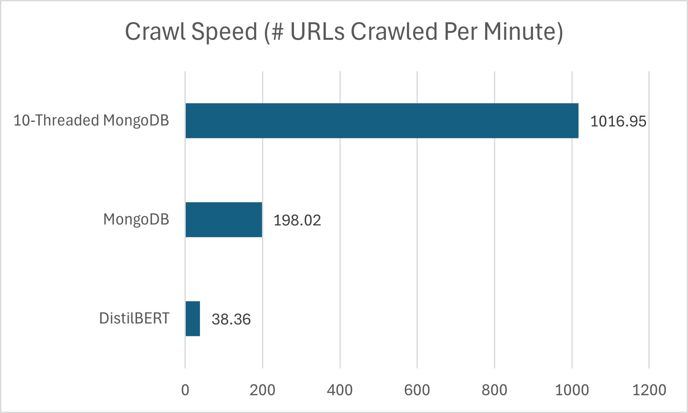
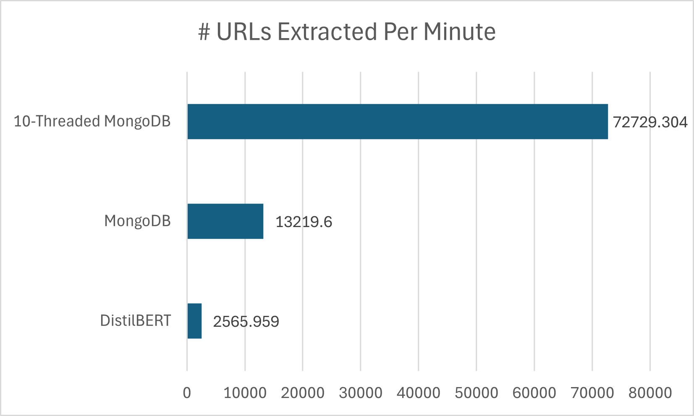
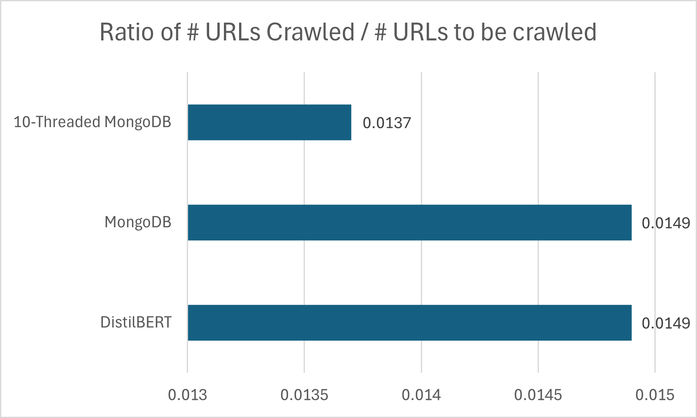

# CS6675 Homework 1: Web Crawler

## Implementation
For Homework 1, I chose to complete option 1.2 and create my own web crawler from scratch. 

I chose https://www.cc.gatech.edu/ as my starting url and chose to focus my crawl on CoC Georgia Tech-related links (includes "cc.gatech.edu" in the url). To fetch the content of the webpage, I used the `requests` python library, and to parse through the retrieved HTML, I used the `BeautifulSoup` library and limited my text retrieval to the first 5000 characters. As for data storage, I explored 2 different approaches. 

### Option 1: Dictionary Storage (option1.ipynb)
The first option I took was to use a dictionary data structure for my inverted index. The structure of an entry looks like `{ keyword: [url1, url2, url3, ...] }`. To extract keywords, I chose to use the DistilBERT model. BERT is a state-of-the-art Transformer model that is used for various NLP tasks including search, sentiment analysis, etc. DistilBERT is a smaller version of BERT that runs 60% faster while preserving 95% performance of the original model. Since speed is an important aspect of web crawler performance, I chose to utilize the faster model. Using this approach, I was able to crawl 1000 urls in 26m 4s, giving me the following crawl statistics:

    1. Total # Keywords Extracted: 1675
    2. # Keywords Extracted Per Minute: 64.26
    3. Crawl Speed (# URLs Crawled Per Minute): 38.36
    4. # URLs Extracted Per Minute: 2565.959
    5. Ratio of # URLs Crawled / # URLs to be crawled: 0.0149

### Option 2: MongoDB (option2.ipynb)
The second approach I explored was using MongoDB as my Web archive. This design decision was motivated by MongoDB's built-in Inverted Index, which allows for keyword and keyphrase lookup without the additional overhead of using an ML model for keyword extraction. Each document has 3 fields: `_id, url, text`. Using this approach, I was able to crawl 1000 urls in 5m 3s, giving me the following crawl statistics:

    1. Crawl Speed (# URLs Crawled Per Minute): 198.02
    2. # URLs Extracted Per Minute: 13219.60
    3. Ratio of # URLs Crawled / # URLs to be crawled: 0.0149

Documents/URLs could then be searched for within the MongoDB database with queries. For example, if someone wanted to search for links related to CS internships and career fairs, they could use the following query:
` 
  {
    "text": {
      "$regex": "(computer science.*internship|career fair)",
      "$options": "i"
    }
  }
`
and get the following response:

### Optimization (multithreaded.py)
Comparing the two options I explored, it is clear that the second option utilizing MongoDB was better in terms of speed and search. Option 2 was able to crawl the same number of URLs almost 17 minutes faster than Option 1 and also provides a better way for searching with more keywords and the ability to search for keyphrases.

Thus, to further optimize my web crawler, I chose to incoporate multi-threading into my Option 2 implementation. I experimented with various thread numbers and arrived at the following conclusion: 

### Crawl Comparisons

## Final Product
The final product can be accessed at webcrawler.py. It utilizes 10 threads and the MongoDB approach for storage. To use, you must create your own MongoDB collection and modify those values within the script (`uri, db, web_crawler`). Once you run the script, you will be prompted to enter a starting URL, a URL narrower, and maximum number of URLs you want to crawl. Once the script finishes, it will print out some crawl statistics including total time of execution, # of URLs crawled, and crawl speed. The following is an example execution:

    Enter starting URL: https://en.wikipedia.org/wiki/Donald_Trump
    What would you like to limit your crawl to? en.wikipedia.org/wiki
    Maximum URLs to crawl: 100

    Starting Crawl...
    Crawl Finished! Here are your crawl statistics: 

    Total time of execution (s): 130.24170660972595
    # URLs crawled: 100
    # URLs extracted: 427121
    Crawl Speed (# URLs crawled per minute): 46.068192410739975
    # URLs Extracted Per Minute: 196766.92410667668
    Ratio of # URLs Crawled / # URLs to be crawled: 0.00023412569271939333
    
### Pros vs. Cons
**Pros**

    1. Speed: with the utilization of 10 threads working in parallel, the web crawler is able to crawl URLs in extremely fast times.
    2. Scalability: MongoDB databases are well-suited for high-throughput writes. With the added parallelism, this solution makes it easy to scale and crawl many pages. 
    3. Usability: with MongoDB's built-in Inverted Index storage, it makes it easy for users to search for specific keywords and even keyphrases. 

**Cons**

    1. Resource Utilization: having 10 threads working in parallel -- eaching making a GET request to some web server -- may put a lot of strain on the computer's CPU and also introduce traffic and high loads within the network. 
    2. Server Strain: if the user ends up crawling on one specific server a lot (putting strain on the server), it could potentially lead to IP bans and rate-limiting.
    3. MongoDB Storage Overhead: since the solution utilizes MongoDB for its Inverted Index storage, it forces the additional overhead of creating, configuring, and managing an additional database outside the current script to the user.

### Predictions
Using my 10-threaded script, I predict the following:

    1. 10 million pages: 590000 seconds = 9833.33 minutes = 163.88 hours = 6.83 days
    2. 1 billion pages: 59 million seconds = 983333.33 minutes = 16388.88 hours = 682.87 days = 1.87 years

## Discussion
This experience was very informative and provided a lot of learning opportunities. Firstly, I was exposed to various keyword extraction methods including DistilBERT, spaCy, and Rake. I also expanded my knowledge of the capabilities of MongoDB that could be helpful when considering the pros and cons of various data storages for future system designs. Finally, I also gained experience with architectural design and learned how to consider the trade-offs of different approaches.
